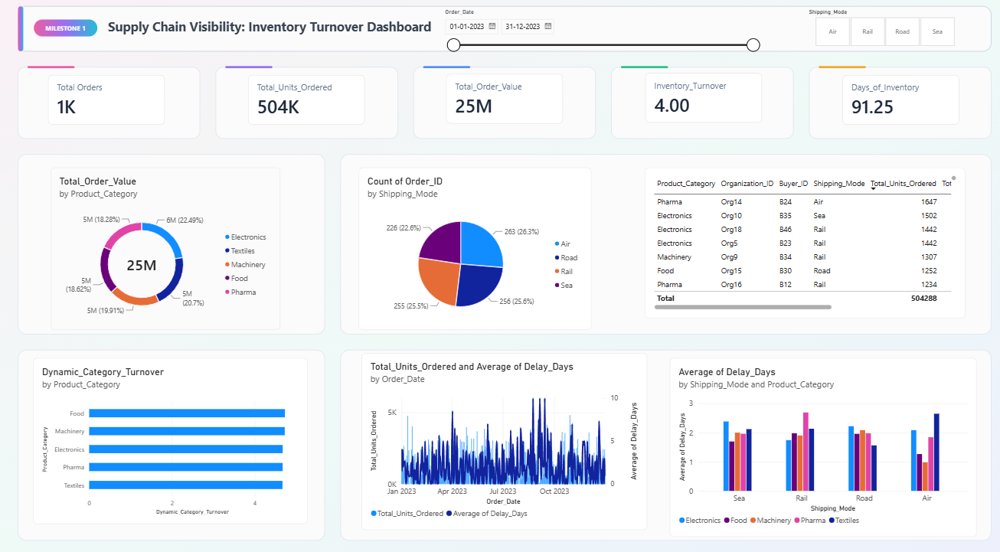
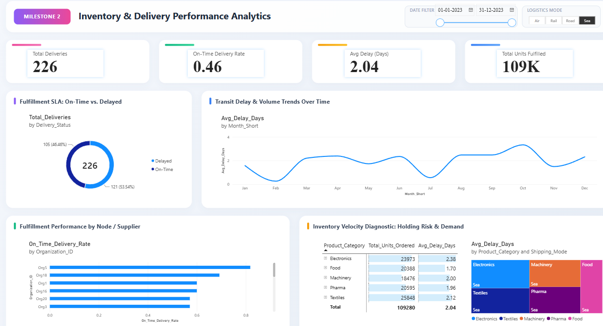
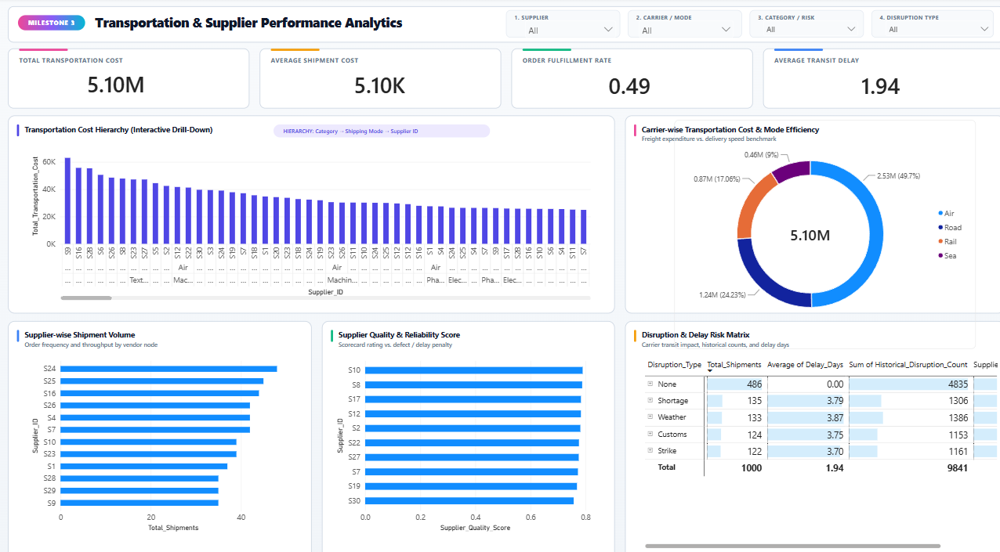
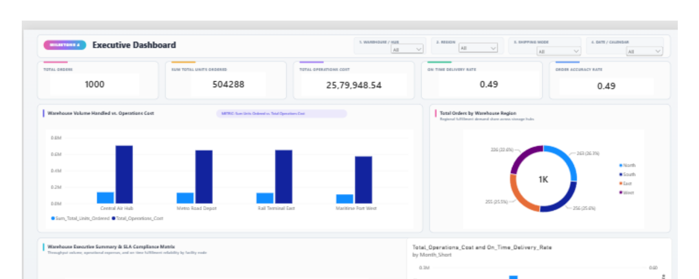
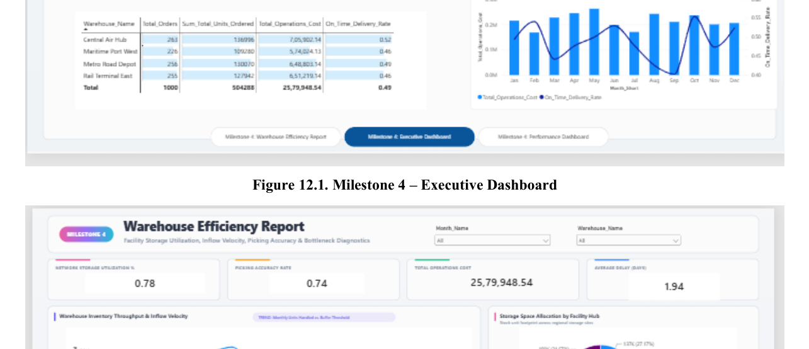
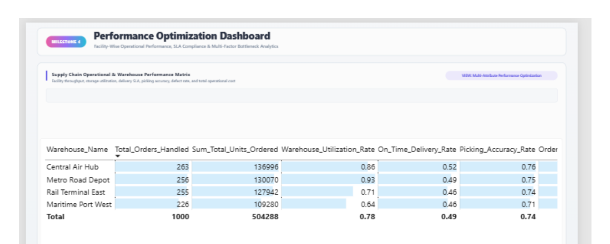

# Supply Chain Visibility System with Optimization Analytics

A Power BI-based analytics solution for monitoring and analyzing supply chain operations across inventory, delivery performance, transportation costs, supplier reliability, warehouse efficiency, and disruption risks.

## Overview

The **Supply Chain Visibility System with Optimization Analytics** transforms transactional supply chain data into structured, interactive business intelligence reports using Microsoft Power BI.

The project aims to provide a unified view of supply chain operations by combining inventory indicators, delivery performance metrics, transportation cost estimates, supplier reliability scores, and warehouse operational measures.

Instead of examining individual operational metrics in isolation, the system enables a progressive analysis of supply chain performance across four milestones, helping identify potential inefficiencies, delivery delays, cost-intensive transportation modes, supplier-related risks, and warehouse bottlenecks.

## Objectives

- Establish supply chain visibility through structured data modeling and inventory analysis.
- Analyze inventory turnover, order volume, order value, and demand-related indicators.
- Evaluate delivery workload, on-time delivery performance, and delay severity.
- Estimate transportation expenditure using predefined shipping-mode freight rates.
- Compare supplier shipment volumes, quality scores, and reliability.
- Examine disruption patterns and their relationship with delivery delays.
- Analyze warehouse utilization, operational costs, throughput, and picking accuracy.
- Develop interactive Power BI reports using KPIs, slicers, drill-down hierarchies, charts, and analytical matrices.
- Support data-driven operational investigation and performance improvement.

## Technology Stack

| Technology | Purpose |
|---|---|
| Microsoft Power BI Desktop | Report development, dashboard design, data modeling, and visualization |
| Power Query | Data cleaning, transformation, standardization, and ETL |
| DAX | Calculated measures, KPI definitions, and analytical logic |
| Kaggle Supply Chain Resilience Dataset | Transactional supply chain data |
| Star Schema | Structured fact-and-dimension data modeling |
| Microsoft Excel / CSV | Source data handling, where applicable |

## Project Architecture

The project follows a data-to-insights workflow:

1. **Data ingestion:** Import supply chain transaction data into Power BI.
2. **Data preparation:** Clean records, standardize column names, convert data types, and prepare analytical fields using Power Query.
3. **Data modeling:** Organize transaction data and supporting dimensions using a star-schema approach.
4. **Measure development:** Define business KPIs and analytical calculations using DAX.
5. **Report development:** Build milestone-specific reports with appropriate visualizations and filters.
6. **Performance analysis:** Interpret cost, delivery, supplier, inventory, and warehouse indicators to identify areas requiring investigation.

## Project Milestones

### Milestone 1 — Supply Chain Visibility & Inventory Turnover

**Objective:** Establish the foundational analytical model and provide an overview of supply chain activity.

#### Key focus areas
- Total orders and ordered quantities.
- Total order value.
- Inventory turnover and estimated inventory days.
- Product-category analysis.
- Shipping-mode distribution.
- Delay trends across periods and logistics modes.

#### Data preparation and modeling

The transaction data is prepared through cleaning, date standardization, numerical and categorical type conversion, duplicate checks, and dimension preparation.

The documented model follows a star-schema structure with descriptive dimensions for areas such as calendar, product, logistics, supplier, and buyer.

#### Key measures

- `Total_Orders` — Counts distinct order identifiers.
- `Total_Units_Ordered` — Calculates total ordered quantities.
- `Total_Order_Value` — Aggregates order value.
- `Inventory_Turnover` — Estimates turnover using the documented inventory assumption.
- `Days_of_Inventory` — Estimates inventory days.
- `Dynamic_Category_Turnover` — Provides a category-level turnover indicator.

**Outcome:** Establishes the analytical foundation and baseline inventory and logistics visibility for subsequent milestones.
## 📸 Project Screenshots

### Milestone 1: Supply Chain Visibility & Inventory Turnover




### Milestone 2 — Inventory & Delivery Performance Analytics

**Objective:** Extend the foundational model to evaluate delivery execution, service performance, and delay behavior.

#### Data transformation

Power Query is used as the ETL layer. Additional analytical fields are created to support delivery and inventory movement analysis.

- `Delivery_Status` — Classifies records into On-Time and Delayed groups based on `Delay_Days`.
- `Stock_Velocity_Segment` — Separates Fast-Moving and Slow-Moving activity using the documented quantity threshold.
- Calendar dimension — Supports chronological monthly analysis using order dates.

#### Key DAX measures

**1. Total Deliveries**

Counts the transaction records included in the current analytical context.

```dax
Total_Deliveries =
COUNTROWS('supply_chain_resilience_dataset csv')
```

**2. On-Time Deliveries**

Counts records classified as On-Time.

```dax
On_Time_Deliveries =
CALCULATE(
    COUNTROWS('supply_chain_resilience_dataset csv'),
    'supply_chain_resilience_dataset csv'[Delivery_Status] = "On-Time"
)
```

**3. On-Time Delivery Rate**

Calculates the proportion of on-time deliveries.

```dax
On_Time_Delivery_Rate =
DIVIDE(
    [On_Time_Deliveries],
    [Total_Deliveries],
    0
)
```

**4. Average Delay Days**

Calculates the average recorded delay.

```dax
Avg_Delay_Days =
AVERAGE('supply_chain_resilience_dataset csv'[Delay_Days])
```

#### Analytical components

- Total delivery workload and service-level indicators.
- Monthly average-delay trends.
- Supplier or organization-level delivery comparisons.
- Holding-risk and demand analysis.
- Category and shipping-mode delay analysis.
- Date and logistics-mode filtering.

#### Documented results

The full-year report records approximately:

- 1,000 deliveries.
- 0.49 displayed on-time delivery rate.
- 1.94 average delay days.
- 504,000 units.

The documented recent-period comparisons show how workload and delivery performance vary over time.

**Outcome:** Adds a delivery-performance layer that helps investigate service-level performance, delay severity, and changes across periods.
## 📸 Project Screenshots : Milestone 2: Inventory & Delivery Performance Analytics




### Milestone 3 — Transportation & Supplier Performance Analytics

**Objective:** Extend the project to transportation expenditure, shipment efficiency, supplier reliability, and disruption-risk analysis.

#### Transportation cost estimation

The dataset does not provide a dedicated freight-expense column. Therefore, the project estimates transportation cost using `Quantity_Ordered` and predefined freight rates according to `Shipping_Mode`.

| Shipping mode | Assumed rate |
|---|---:|
| Air | 18.5 |
| Sea | 4.2 |
| Rail | 6.8 |
| Road | 9.5 |
| Default | 8.0 |

These rates are assumptions used in the analytical model and do not represent verified real-world freight charges.

#### Key DAX measures

**1. Total Transportation Cost**

```dax
Total_Transportation_Cost =
SUMX(
    'supply_chain_resilience_dataset csv',
    'supply_chain_resilience_dataset csv'[Quantity_Ordered] *
    SWITCH(
        'supply_chain_resilience_dataset csv'[Shipping_Mode],
        "Air", 18.5,
        "Sea", 4.2,
        "Rail", 6.8,
        "Road", 9.5,
        8.0
    )
)
```

This measure calculates the estimated transportation cost for each transaction and aggregates the results.

**2. Average Shipment Cost**

```dax
Avg_Shipment_Cost =
DIVIDE(
    [Total_Transportation_Cost],
    COUNTROWS('supply_chain_resilience_dataset csv'),
    0
)
```

This measure divides the estimated transportation cost by the number of transaction records. It is a record-level average and should not automatically be interpreted as the cost of a unique physical shipment.

**3. Order Fulfillment Rate**

```dax
Order_Fulfillment_Rate =
DIVIDE(
    CALCULATE(
        COUNTROWS('supply_chain_resilience_dataset csv'),
        'supply_chain_resilience_dataset csv'[Delay_Days] = 0,
        'supply_chain_resilience_dataset csv'[Supply_Risk_Flag] = 0
    ),
    COUNTROWS('supply_chain_resilience_dataset csv'),
    0
)
```

This measure considers records with zero delay and no supply-risk flag.

**4. On-Time Delivery Rate**

```dax
On_Time_Delivery_Rate =
DIVIDE(
    CALCULATE(
        COUNTROWS('supply_chain_resilience_dataset csv'),
        'supply_chain_resilience_dataset csv'[Delay_Days] <= 0
    ),
    COUNTROWS('supply_chain_resilience_dataset csv'),
    0
)
```

This calculation treats zero or negative delay values as on-time or early deliveries.

**5. Supplier Quality Score**

```dax
Supplier_Quality_Score =
AVERAGE(
    'supply_chain_resilience_dataset csv'[Supplier_Reliability_Score]
)
```

Calculates the average supplier reliability score within the current analytical context.

**6. Total Shipments**

```dax
Total_Shipments =
COUNTROWS('supply_chain_resilience_dataset csv')
```

Counts transaction records used as shipment records in the model.

#### Analytical components

- Transportation cost hierarchy across product category, shipping mode, and supplier.
- Carrier-wise estimated transportation expenditure.
- Shipment-volume comparison across the top 10 suppliers.
- Supplier quality and reliability comparison.
- Disruption and delay risk matrix.
- Filtering by supplier, shipping mode, product category, and disruption type.

#### Documented results

The displayed report state records approximately:

- 2.53 million in estimated transportation cost.
- 9.64 thousand in average shipment cost.
- 0.52 order fulfillment rate.
- 1.76 for the displayed delay/transit indicator.

These are documented dashboard values under the selected analytical context. They should not be treated as independently verified financial results.

**Outcome:** Connects transportation expenditure, shipment activity, supplier reliability, and disruption exposure within a unified analytical framework.

## 📸 Project Screenshots : Milestone 3: Transportation & Supplier Performance Analytics




### Milestone 4 — Warehouse Analytics & Performance Optimization

**Objective:** Extend supply chain analysis to warehouse capacity, operational expenditure, fulfillment accuracy, and facility-level performance.

#### Data preparation and modeling

Power Query transformations prepare warehouse-related attributes while retaining the underlying transaction records.

A route-based warehouse key is introduced according to the documented mapping:

| Shipping mode | Assigned warehouse |
|---|---|
| Air | WH-1 |
| Road | WH-2 |
| Rail | WH-3 |
| Sea | WH-4 |

A dedicated `Dim_Warehouse` dimension is introduced with attributes including warehouse ID, warehouse name, region, storage capacity, base operational cost, and target picking accuracy.

An active one-to-many relationship is established between `Dim_Warehouse[Warehouse_ID]` and `Fact_SupplyChain_Orders[Warehouse_ID]`.

#### Analytical measures

The milestone includes measures for:

- Total orders and ordered units.
- Warehouse utilization rate.
- On-time delivery rate.
- Picking accuracy rate.
- Order accuracy rate.
- Average delay days.
- Total operational cost.

The documented operational-cost approach combines facility baseline cost, per-unit handling, and machine energy expenditure.

#### Reporting suite

**Executive Dashboard**
- Summarizes network-level order volume, operational cost, and service performance.
- Compares warehouse workload and operational expenditure.
- Provides regional order distribution and a warehouse-level SLA summary.

**Warehouse Efficiency Report**
- Examines storage utilization and throughput.
- Compares stock volume with capacity limits.
- Evaluates picking and fulfillment accuracy by category.
- Supports facility-level bottleneck investigation.

**Performance Optimization Dashboard**
- Consolidates warehouse workload, utilization, delivery performance, and picking accuracy.
- Supports comparisons across the four modeled facilities.
- Helps identify facilities requiring closer operational investigation.

**Outcome:** Extends the analytical system from transaction and logistics analysis to warehouse-level operational performance and optimization.

## 📸 Project Screenshots: Milestone 4: Warehouse Analytics & Performance Optimization

#### Executive Dashboard



#### Warehouse Efficiency Report



#### Performance Optimization Dashboard



## Interactive Reporting Features

The Power BI reports incorporate features designed to support exploratory analysis:

- **KPI cards:** Summarize key performance indicators.
- **Slicers:** Filter analysis by dimensions such as dates, shipping modes, suppliers, categories, and disruptions.
- **Drill-down hierarchies:** Enable more detailed investigation across analytical levels.
- **Comparative charts:** Support comparisons across suppliers, categories, logistics modes, and facilities.
- **Analytical matrices:** Bring multiple performance and risk indicators together.
- **Time-based analysis:** Supports comparisons across reporting periods.

These features allow users to investigate the context behind summary values instead of relying on a single KPI.


The data folder may contain dataset instructions or permitted sample data. Do not commit confidential or restricted datasets.

## How to Use the Project

1. Clone or download the repository.
2. Install Microsoft Power BI Desktop.
3. Obtain the source dataset and place it in the configured location.
4. Open the Power BI project file, if included.
5. Update the data-source path if necessary.
6. Refresh the data model and confirm that relationships and calculated measures work correctly.
7. Navigate through the milestone reports and explore the available analytical filters.
8. Review the project documentation for the calculation assumptions and interpretation of the results.

**Note:** The repository must contain the corresponding Power BI file and source data, or instructions for obtaining them, for the workflow above to be fully reproducible.

## Key Considerations and Limitations

- Transportation costs are estimated using predefined shipping-mode rates rather than recorded freight expenses.
- Average shipment cost is calculated using transaction-row count; it may differ from the cost per unique shipment.
- The order fulfillment rate and on-time delivery rate use different definitions and should not be treated as interchangeable.
- Inventory turnover and inventory days in Milestone 1 rely on documented assumptions and are analytical estimates.
- Warehouse IDs are assigned through a shipping-mode mapping in Milestone 4. These assignments represent the project's model and should not be interpreted as verified physical warehouse routing.
- Reported KPI values depend on the available dataset, the measures implemented, and the current filter context.
- The analytical results indicate areas for further investigation; they do not by themselves establish causation.

## Future Enhancements

Potential extensions include:

- Integrating actual freight invoices and transportation tariffs.
- Incorporating real-time shipment tracking and inventory updates.
- Adding predictive models for delivery delays and supplier disruptions.
- Developing inventory demand forecasting and replenishment recommendations.
- Comparing estimated transportation cost with actual logistics expenditure.
- Adding warehouse capacity alerts and bottleneck detection.
- Implementing automated report refresh and exception notifications.
- Evaluating optimization scenarios for shipping-mode selection and supplier allocation.

These are proposed enhancements rather than features claimed to be implemented in the current project.

## Learning Outcomes

Through this project, the work covers:

- Data cleaning and transformation using Power Query.
- Analytical data modeling using a star schema.
- Business measure development using DAX.
- KPI design and performance reporting.
- Transportation and supplier analytics.
- Risk-oriented analysis of delivery and disruption patterns.
- Warehouse-level operational analysis.
- Translating transactional data into decision-support information.

## References

1. **Infosys Springboard** — Learning Microsoft Power BI.
2. **Infosys Springboard** — Hands-On Data Visualization with Microsoft Power BI.
3. **Infosys Springboard** — Power BI for Business Professionals.
4. **Microsoft Learn** — Power BI documentation.
5. **Microsoft Learn** — Star schema guidance for Power BI.
6. **Microsoft Learn** — Model relationships in Power BI Desktop.
7. **Microsoft Learn** — Data Analysis Expressions (DAX) reference.
8. **Kaggle** — Accenture Supply Chain Resilience Challenge Dataset.

The project documentation identifies these resources as references for Power BI, data modeling, visualization, DAX, and the supply chain dataset.

## Author

**M S Surya Gayathri**

Project: Supply Chain Visibility System with Optimization Analytics

Tools: Microsoft Power BI, Power Query, DAX

---

*This project demonstrates how structured data preparation, analytical modeling, and business intelligence reporting can be combined to examine supply chain performance across inventory, delivery, transportation, suppliers, and warehouse operations.*
